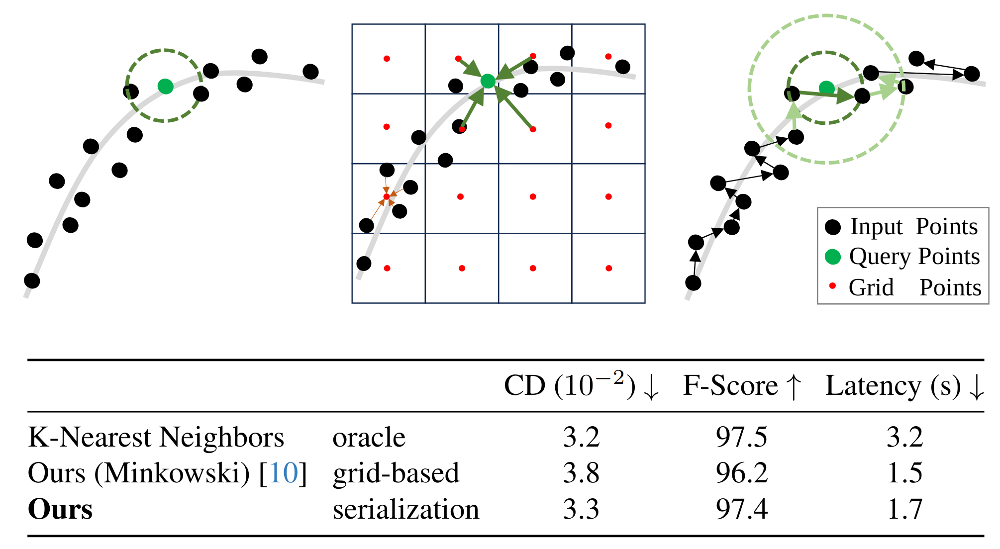

# NoKSR: Kernel-Free Neural Surface Reconstruction via Point Cloud Serialization



**NoKSR: Kernel-Free Neural Surface Reconstruction via Point Cloud Serialization**<br>
[Zhen Li <sup>*</sup>](https://colinzhenli.github.io/), [Weiwei Sun <sup>*†</sup>](https://wsunid.github.io/), [Shrisudhan Govindarajan](https://shrisudhan.github.io/), [Shaobo Xia](https://scholar.google.com/citations?user=eOPO9E0AAAAJ&hl=en), [Daniel Rebain](http://drebain.com/), [Kwang Moo Yi](https://www.cs.ubc.ca/~kmyi/), [Andrea Tagliasacchi](https://theialab.ca/)  
**[Paper](https://arxiv.org/abs/2502.12534), [Project Page](https://theialab.github.io/noksr/)**

Abstract: We present a novel approach to large-scale point cloud
surface reconstruction by developing an efficient framework
that converts an irregular point cloud into a signed distance
field (SDF). Our backbone builds upon recent transformer-
based architectures (i.e. PointTransformerV3), that serial-
izes the point cloud into a locality-preserving sequence of
tokens. We efficiently predict the SDF value at a point by ag-
gregating nearby tokens, where fast approximate neighbors
can be retrieved thanks to the serialization. We serialize
the point cloud at different levels/scales, and non-linearly
aggregate a feature to predict the SDF value. We show
that aggregating across multiple scales is critical to over-
come the approximations introduced by the serialization
(i.e. false negatives in the neighborhood). Our frameworks
sets the new state-of-the-art in terms of accuracy and effi-
ciency (better or similar performance with half the latency
of the best prior method, coupled with a simpler implemen-
tation), particularly on outdoor datasets where sparse-grid
methods have shown limited performance. 

Contact [Zhen Li @ SFU](zla247@sfu.ca) for questions, comments and reporting bugs.

## Related Package

We implemented the fast approximate neighbor search algorithm in the package [`serial-neighbor`](https://pypi.org/project/serial-neighbor/) — a standalone pip package that provides fast and flexible point cloud neighbor search using serialization encoding by space-filling curves (Z-order, Hilbert, etc.).

- **📦 PyPI**: [`serial-neighbor`](https://pypi.org/project/serial-neighbor/)
- **🔗 GitHub**: [https://github.com/colinzhenli/serial-neighbor](https://github.com/colinzhenli/serial-neighbor)

You can install it via:

```bash
pip install serial-neighbor
```

## News    

- [2025/03/22] The package [`serial-neighbor`](https://pypi.org/project/serial-neighbor/) is released.
- [2025/02/21] The code is released.
- [2025/02/19] The arXiv version is released.

## Environment setup

The code is tested on Ubuntu 20.04 LTS with PyTorch 2.0.0 CUDA 11.8 installed. Please follow the following steps to install PyTorch first.

```
# Clone the repository
git clone https://github.com/theialab/noksr.git
cd noksr

# create and activate the conda environment
conda create -n noksr python=3.10
conda activate noksr

# install PyTorch 2.x.x
conda install pytorch==2.0.0 pytorch-cuda=11.8 -c pytorch -c nvidia

```
Then, install PyTorch3D
```
# install runtime dependencies for PyTorch3D
conda install -c fvcore -c iopath -c conda-forge fvcore iopath
conda install -c bottler nvidiacub

# install PyTorch3D
conda install pytorch3d -c pytorch3d
```

Install the necessary packages listed out in requirements.txt:
```
pip install -r requirements.txt
```

Install torch-scatter and nksr
```
pip install torch-scatter -f https://data.pyg.org/whl/torch-2.0.0+cu118.html 
pip install nksr -f https://nksr.huangjh.tech/whl/torch-2.0.0+cu118.html 
```

The detailed installation of nksr is described in the [NKSR](https://github.com/nv-tlabs/nksr).

## Reproducing results from the paper

### Data Preparation

You can download the data from the following links and put it under `NoKSR/data/`.
- ScanNet:
Data is available [here](https://drive.google.com/drive/folders/1JK_6T61eQ07_y1bi1DD9Xj-XRU0EDKGS?usp=sharing).
We converted original meshes to `.pth` data, and the normals are generated using the [open3d.geometry.TriangleMesh](https://www.open3d.org/html/python_api/open3d.geometry.TriangleMesh.html). The processing detailed from raw scannetv2 data is from [minsu3d](https://github.com/3dlg-hcvc/minsu3d).

- SceneNN
Data is available [here](https://drive.google.com/file/d/1d_ILfaxpJBpiiwCZtvC4jEKnixEr9N2l/view?usp=sharing).

- SyntheticRoom
Data is available [here](https://drive.google.com/drive/folders/1PosV8qyXCkjIHzVjPeOIdhCLigpXXDku?usp=sharing), it is from [ConvONet](https://github.com/autonomousvision/convolutional_occupancy_networks), which contains the processing details.

- CARLA
Data is available [here](https://drive.google.com/file/d/1BFwExw7SRJaqHJ98pqqnR-k6g8XYMAqq/view?usp=sharing), it is from [NKSR](https://github.com/nv-tlabs/nksr).


### Training
Note: Configuration files are managed by [Hydra](https://hydra.cc/), you can easily add or override any configuration attributes by passing them as arguments.
```shell
# log in to WandB
wandb login

# train a model from scratch
# ScanNet dataset
python train.py model=scannet_model data=scannet
# SyntheticRoom dataset
python train.py model=synthetic_model data=synthetic
# CARLA dataset
python train.py model=carla_model data=carla_patch
```

In addition, you can manually specify different training settings. Common flags include:
- `experiment_name`: Additional experiment name to specify.
- `data.dataset_root_path`: Root path of the dataset.
- `output_folder`: Output folder to save the results, the checkpoints will be saved in `output/{dataset_name}/{experiment_name}/training`.
- `model.network.default_decoder.neighboring`: Neighboring type, default is `Serial`. Options: `Serial`, `KNN`, `Mixture`

### Inference

You can either infer using your own trained models or our pre-trained checkpoints.

The pre-trained checkpoints on different datasets with different neighboring types are available [here](https://drive.google.com/file/d/1hMm5cnCOfNmr_PgkpOmwRnzCCG4wPqnu/view?usp=drive_link), you can download and put them under `noksr/checkpoints/`.

```bash
# For example, Carla original dataset with Serialization neighboring, you need more than 24GB GPU memory to inferece the CARLA dataset, we recommend using a server.
python eval.py model=carla_model data=carla_original model.ckpt_path=checkpoints/Carla_Serial_best.ckpt
# For example, Carla model with Laplacian loss
python eval.py model=carla_model data=carla_original model.ckpt_path=checkpoints/Carla_Laplacian_best.ckpt
# For example, ScanNet dataset with Serialization neighboring
python eval.py model=scannet_model data=scannet model.ckpt_path=checkpoints/ScanNet_Serial_best.ckpt model.inference.split=val
# For example, Test on SceneNN dataset with model trained on ScanNet.
python eval.py model=scenenn_model data=scenenn model.ckpt_path=checkpoints/ScanNet_KNN_best.ckpt
```
In addition, in the Carla dataset, you can enable reconstruction from segments. This option will be slower but will save a lot of memory. Flags include:
- `data.reconstruction.by_segment=True`: Enable reconstruction from segments.
- `data.reconstruction.segment_num=10`: Number of segments.

### Reconstruction
You can reconstruct a specific scene from the datasets above by specifying the scene index.
```bash
# For example, Carla dataset, 0 can be replaced by any other scene index of validation set
python eval.py model=carla_model data=carla_original model.ckpt_path={path_to_checkpoint} data.over_fitting=True data.take=1 data.intake_start=0
# For example, ScanNet dataset, 308 can be replaced by any other scene index of validation set
python eval.py model=scannet_model data=scannet model.ckpt_path={path_to_checkpoint} data.over_fitting=True data.take=1 data.intake_start=308 model.inference.split=val

```
In addition, you can manually specify visualization settings. Flags include:
- `data.visualization.save=True`: When to save the results.
- `data.visualization.Mesh=True`: When to save the reconstructed mesh.
- `data.visualization.Input_points=True`: When to save the input points.
 
The results will be saved in `output/{dataset_name}/{experiment_name}/reconstruction/visualization`.

## Acknowledgement
This work was supported in part by the Natural Sciences and Engineering Research Council of Canada (NSERC) Discovery Grant, NSERC Collaborative Research and Development Grant, Google DeepMind, Digital Research Alliance of Canada, the Advanced Research Computing at the University of British Columbia, and the SFU Visual Computing Research Chair program. Shaobo Xia was supported
by National Natural Science Foundation of China under Grant 42201481. We would also like to thank Jiahui Huang for the valuable discussion and feedback.

## BibTex
If you find our work useful in your research, please consider citing:
```bibtex
@article{li2025noksrkernelfreeneuralsurface,
  author    = {Zhen Li and Weiwei Sun and Shrisudhan Govindarajan and Shaobo Xia and Daniel Rebain and Kwang Moo Yi and Andrea Tagliasacchi},
  title     = {NoKSR: Kernel-Free Neural Surface Reconstruction via Point Cloud Serialization},
  year      = {2025},
  booktitle   = {International Conference on 3D Vision (3DV)},
}
```
